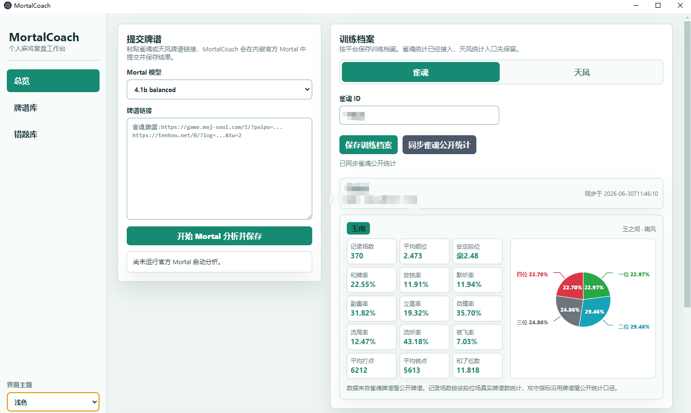
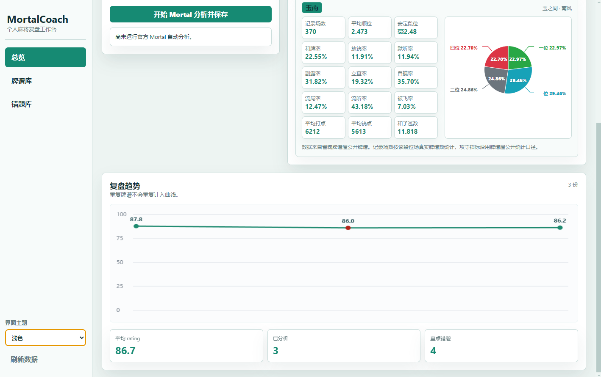
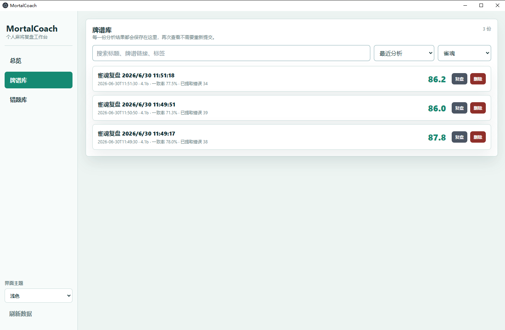
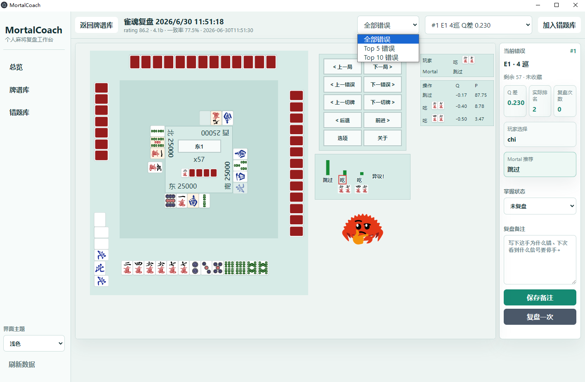
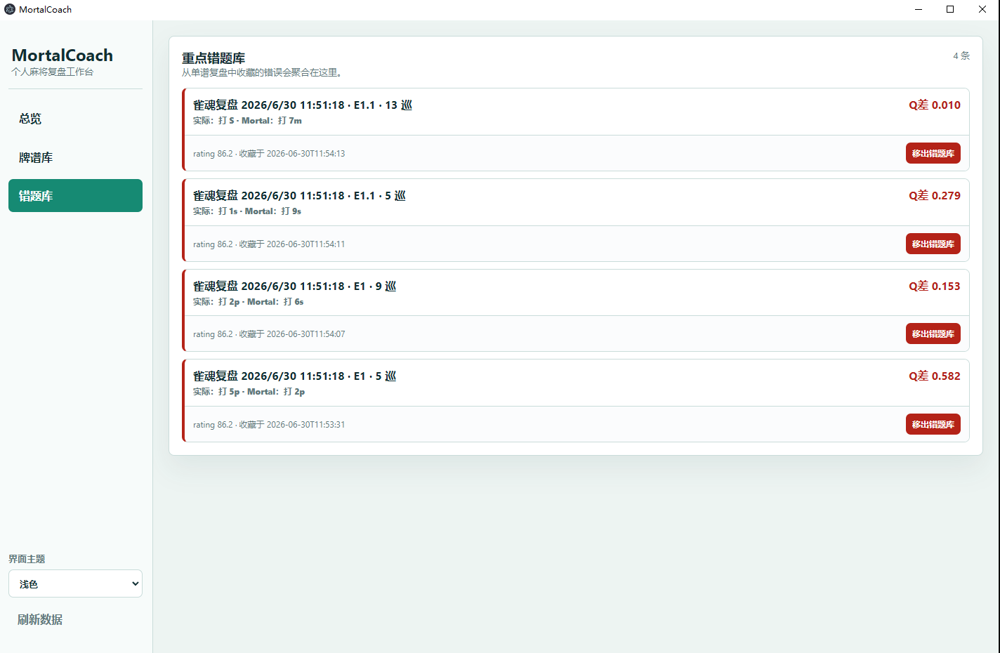

# MortalCoach

MortalCoach 是一个面向雀魂 / 天凤玩家的本地麻将复盘管理软件。

它不是重新训练 Mortal，也不要求普通玩家准备 Mortal 模型权重。你只需要把牌谱链接粘贴进软件，MortalCoach 会在软件内提交官方 Mortal 分析，并把结果保存到本地牌谱库，之后可以随时重新打开复盘。

## 它解决什么问题

官方 Mortal 网页很好用，但有一个明显痛点：分析结果不方便长期保存和管理。

MortalCoach 想做的是：

1. 粘贴雀魂或天凤牌谱链接。
2. 在软件内完成官方 Mortal 分析。
3. 自动保存 rating、错误列表和棋盘复盘数据。
4. 在本地牌谱库中管理所有复盘。
5. 用棋盘界面复盘全部错误、Top 5 错误或 Top 10 错误。

## 截图

### 首页总览



### 复盘趋势



### 牌谱库



### 棋盘复盘



### 错题库



## 快速开始

### 需要先安装

- Windows 10 / 11
- Python 3.10+
- Node.js 20+
- Git，或者直接从 GitHub 下载 ZIP

### 方式一：使用 Git

```powershell
git clone https://github.com/NingYiwu94/MortalCoach.git
cd MortalCoach
.\Start-MortalCoach.bat
```

### 方式二：不会用 Git

1. 打开本仓库 GitHub 页面。
2. 点击绿色的 `Code`。
3. 点击 `Download ZIP`。
4. 解压 ZIP。
5. 双击根目录里的 `Start-MortalCoach.bat`。

第一次启动会自动安装 Electron 依赖，可能需要等一会儿。之后会打开 MortalCoach 桌面窗口。

如果启动失败，在仓库根目录运行：

```powershell
.\Start-MortalCoach.bat doctor
```

## 主要功能

- 软件内提交官方 Mortal 分析
- 保存已分析牌谱，避免重复分析同一份复盘
- 牌谱库支持搜索、筛选、排序、删除和直接重命名
- 复盘趋势图显示 Mortal rating 变化
- 训练档案支持雀魂公开统计同步入口，天凤入口已预留
- 复盘界面使用 KillerDucky 棋盘 UI
- 支持深色 / 浅色主题
- 复盘时可切换全部错误、Top 5、Top 10
- 右侧复盘栏会跟随棋盘里的上一错误 / 下一错误同步

## 普通玩家怎么用

1. 启动 `Start-MortalCoach.bat`。
2. 在首页粘贴雀魂或天凤牌谱链接。
3. 选择 Mortal 模型版本。
4. 点击“开始 Mortal 分析并保存”。
5. 等官方 Mortal 分析完成。
6. 回到牌谱库，之后这份复盘就会一直保存在本地。

重新打开已保存牌谱时，不需要再跑一次官方分析。

## 数据保存在哪里

MortalCoach 会在首次运行时自动创建：

```text
mortalcoach/data/
```

这里保存你的本地牌谱库、复盘记录、训练档案和 Electron 本地配置。

这个目录包含个人数据，已经被 `.gitignore` 排除，不会上传到 GitHub。

## 重要说明

Mortal 开源代码本身不附带官方训练好的模型权重。MortalCoach 当前默认依赖官方 Mortal 网页完成分析，这样普通玩家无需配置本地模型。

本项目不会保存你的雀魂或天凤账号密码。官方分析流程在内嵌网页中完成；如遇到官方站点的人机验证，需要在窗口内手动完成。

## 常见问题

### 需要自己准备 Mortal 模型权重吗？

不需要。普通用户直接使用官方 Mortal 网页分析路线即可。

### 第一次启动为什么比较慢？

第一次启动会自动安装 Electron 依赖。安装完成后，后续启动会快很多。

如果网络较慢，安装可能需要多等一会儿。

### 我该点哪个文件启动？

只需要点根目录的：

```text
Start-MortalCoach.bat
```

### 支持 macOS / Linux 吗？

当前主要面向 Windows。核心后端是 Python + Web，理论上可以迁移，但桌面启动脚本和默认使用流程优先保证 Windows。

## 项目结构

```text
MortalCoach/
  Start-MortalCoach.bat       一键启动入口
  README.md                   GitHub 首页说明
  PROJECT_DIRECTION.md         产品方向说明
  docs/                       文档和截图
  killer_mortal_gui/          KillerDucky 棋盘复盘 UI，本项目做了嵌入适配
  mortalcoach/                MortalCoach 应用本体
```

## 第三方项目

MortalCoach 集成并适配了 KillerDucky 的 `killer_mortal_gui`：

- 上游项目：<https://github.com/killerducky/killer_mortal_gui>
- 许可证：MIT，保留在 `killer_mortal_gui/LICENSE`

官方 Mortal / mjai-reviewer：

- <https://mjai.ekyu.moe/>
- <https://github.com/Equim-chan/mjai-reviewer>
- <https://github.com/Equim-chan/Mortal>

## 许可证

MortalCoach 本体采用 MIT License，详见 [LICENSE](LICENSE)。

第三方项目仍保留其原始许可证说明；其中 `killer_mortal_gui` 的 MIT License 保留在 `killer_mortal_gui/LICENSE`。
